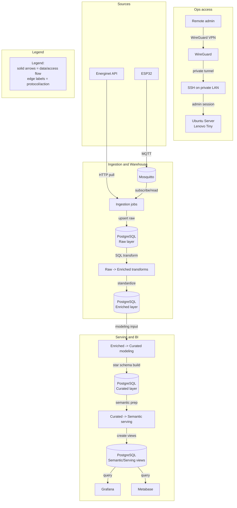
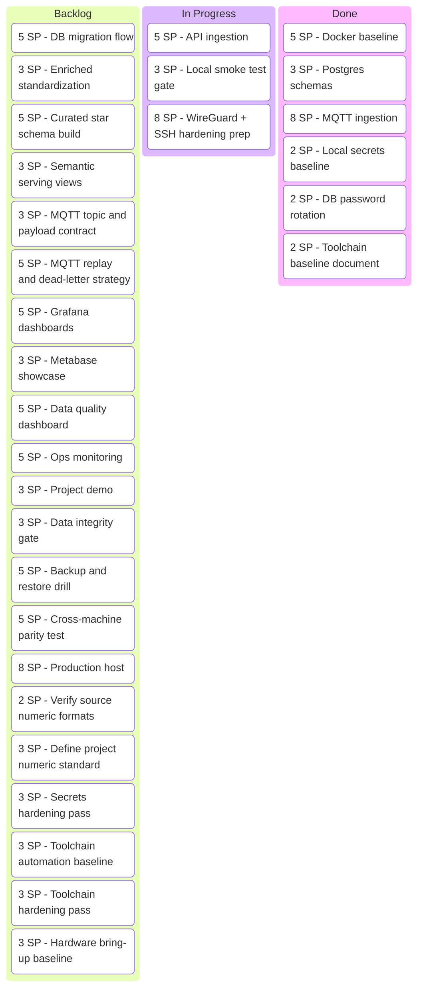
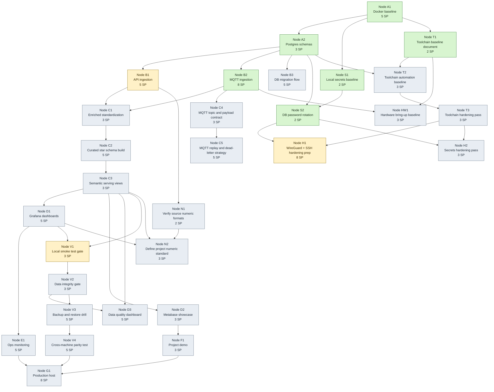

# commons-anchor

Open-source home-lab data platform for applied learning and technical demonstration.

This project demonstrates end-to-end data engineering and applied data science on self-hosted Linux infrastructure:
- PostgreSQL-based data warehouse
- IoT ingestion from ESP32 via MQTT
- Public API ingestion (for example Energinet data)
- Dashboard delivery for analysis and operations
- Secure remote administration with VPN and SSH

## Project intent

Primary profile:
- Energy domain understanding + data scientist mindset
- Infrastructure as enablement, not as the main role

Primary project value order:
1. Learning progression and engineering discipline
2. Business and decision value
3. Climate and citizen-science relevance

## Professional summary

This repository is built as a practical showcase of:
- data architecture design
- SQL and Python delivery
- reproducible analytics workflows
- operational responsibility on Linux and containers

The long-term target runtime is a used Lenovo Tiny running Ubuntu Server, with a fully self-hosted stack.

## Contributor setup (5 min)

Use this when a new person clones the repository and wants a working local setup quickly.

1. Create local env from template:

```powershell
Copy-Item .env.example .env
```

2. Create local secret files (never committed):

```powershell
New-Item -ItemType Directory -Force infra/secrets | Out-Null
Set-Content infra/secrets/postgres_password.secret "<strong-postgres-password>"
Set-Content infra/secrets/grafana_admin_password.secret "<strong-grafana-password>"
```

3. Start core services:

```powershell
docker compose up -d
```

4. Verify secrets are ignored:

```powershell
git check-ignore -v .env
git check-ignore -v infra/secrets/postgres_password.secret
git check-ignore -v wg-client.conf
```

5. Open Grafana and verify login:
- URL: http://localhost:3000
- User: value of `GF_SECURITY_ADMIN_USER` in `.env`
- Password: value stored in `infra/secrets/grafana_admin_password.secret`

For the full security/reproducibility contract, see [docs/security/local-secrets-baseline.md](docs/security/local-secrets-baseline.md).

## Motivation

The project is intentionally designed as a long-term learning system.
The tech-tree is not only planning documentation, but a personal motivation tool to keep progress measurable and visible.

## Architecture diagrams

System architecture:

<!-- AUTO_SYSTEMARCH_START -->

<!-- AUTO_SYSTEMARCH_END -->

Project kanban:

<!-- AUTO_KANBAN_START -->

<!-- AUTO_KANBAN_END -->

Tech-tree (dependency path):

<!-- AUTO_TECHTREE_START -->

<!-- AUTO_TECHTREE_END -->

Validation gates:
- [docs/infra/environment-validation.md](docs/infra/environment-validation.md)
- [Platform Smoke Gate workflow](.github/workflows/platform-smoke.yml)

Diagram standards and templates:
- [docs/architecture/mermaid-guidelines.md](docs/architecture/mermaid-guidelines.md)
- [docs/architecture/mermaid-templates.md](docs/architecture/mermaid-templates.md)

Terminology glossary:
- [docs/glossary.md](docs/glossary.md)

Toolchain definition:
- [docs/toolchain.md](docs/toolchain.md)

Data warehouse strategy:
- [docs/architecture/data-warehouse-strategy.md](docs/architecture/data-warehouse-strategy.md)

Local secrets baseline:
- [docs/security/local-secrets-baseline.md](docs/security/local-secrets-baseline.md)

## SQL syntax checks (PostgreSQL)

If you come from SQL Server, it is easy to accidentally use T-SQL syntax that PostgreSQL rejects.
Use the built-in parser-based checker to validate all SQL scripts under `infra/sql`:

```bash
python -m pip install .[dev]
check-sql-syntax
```

Optional custom path:

```bash
check-sql-syntax --root path/to/sql
```

## Data architecture (layered model)

Target warehouse model is Raw/Enriched/Curated/Serving:
- Raw: raw, immutable ingestion from APIs and MQTT
- Enriched: cleaned, standardized, quality-checked datasets
- Curated: analytics-ready marts for dashboards and ML features
- Serving: semantic views for stable BI consumption (Grafana/Metabase)

Modeling direction:
- Raw and Enriched are source-oriented (each source has its own grouping/module).
- Curated is business-oriented and modeled as star schemas (facts and dimensions).

MVP schema mapping (conceptual -> physical):
- Raw -> `staging`
- Curated -> `mart`
- Enriched -> planned as a dedicated schema in a later phase

This keeps the conceptual model stable while the physical schema evolves incrementally.

See the full strategy in [docs/architecture/data-warehouse-strategy.md](docs/architecture/data-warehouse-strategy.md).

## Terminology (short glossary)

- Raw: raw source data with minimal processing
- Enriched: cleaned and standardized datasets
- Curated: analytics-ready datasets
- Baseline model: first reference model used for iterative improvement
- Tech-tree: dependency map for planned delivery path

See the full glossary in [docs/glossary.md](docs/glossary.md).

## ML strategy

Approach:
- Iterative modeling and forecasting in the same loop

Execution cycle:
1. Train simple baseline models
2. Forecast on 15-minute grain for public data
3. Compare predictions with actual observations
4. Improve features, transformations, and model choices

Data grain policy:
- Public spot prices: 15-minute intervals (MVP baseline)
- IoT telemetry: around 5-minute intervals, aggregated to hourly for shared analysis

## Technology choices

Core stack:
- PostgreSQL 16
- Eclipse Mosquitto 2
- Grafana 11
- Metabase 0.53
- Docker Compose

Principles:
- Open-source first
- Professional tooling and reproducibility
- Low-cost setup (hardware + power + internet are main non-software costs)

## Quick start (local)

Windows note (recommended):
- If your shell cannot find `python`, `pip`, or `pytest`, use the virtualenv executable explicitly:

  ```powershell
  .\.venv\Scripts\python.exe -m pip install -e .[dev]
  .\.venv\Scripts\python.exe -m pytest -q
  ```

  This avoids PATH issues and ensures all commands run in the same environment.

1. Copy env file

	```powershell
	Copy-Item .env.example .env
	```

2. Create local secret files (not tracked by git)

  ```powershell
  New-Item -ItemType Directory -Force infra/secrets | Out-Null
  Set-Content infra/secrets/postgres_password.secret "<strong-postgres-password>"
  Set-Content infra/secrets/grafana_admin_password.secret "<strong-grafana-password>"
  ```

  For contributor onboarding and the full local secrets contract, see [docs/security/local-secrets-baseline.md](docs/security/local-secrets-baseline.md).

3. Update non-secret settings in .env if needed

4. Start stack

	```powershell
	docker compose up -d
	```

5. Smoke-test Energi Data Service ingestion into PostgreSQL

  ```powershell
  docker compose --profile jobs run --rm energidata-ingest
  ```

6. Verify raw rows landed in PostgreSQL

  ```powershell
  docker compose exec postgres psql -U $env:POSTGRES_USER -d $env:POSTGRES_DB -c "SELECT dataset, area, ts_utc, price_dkk_mwh FROM staging.energinet_raw ORDER BY ts_utc DESC LIMIT 10;"
  ```

7. Run first mart transformation (15-minute curated)

  ```powershell
  docker compose --profile jobs run --rm power-price-transform
  ```

8. Verify curated quarter-hour rows landed in mart

  ```powershell
  docker compose exec postgres psql -U $env:POSTGRES_USER -d $env:POSTGRES_DB -c "SELECT ts_utc, area, price_dkk_mwh FROM mart.power_price_15min ORDER BY ts_utc DESC, area ASC LIMIT 10;"
  ```

9. MQTT ingestion smoke test (phone/ESP32 -> MQTT -> Postgres)

  ```powershell
  docker compose up -d --build mqtt mqtt-ingest postgres
  ```

  MQTT ingest defaults:
  - Topic filter: `ca/dev/+/telemetry`
  - QoS: `1` (configurable with `MQTT_QOS` in `.env`)
  - Source tag: `phone_or_esp32` (configurable with `MQTT_SOURCE`)

  Expected payload contract (JSON object):

  ```json
  {"device_id":"phone01","temp_c":22.7,"hum_pct":41.8,"ts":"2026-03-17T20:30:00Z"}
  ```

  Required fields:
  - `device_id` (non-empty string)
  - `ts` (ISO timestamp)

  Worker behavior:
  - Valid JSON + valid contract -> row inserted into `staging.mqtt_raw`
  - Invalid JSON or invalid contract -> message skipped and logged

  Publish JSON telemetry to topic `ca/dev/phone01/telemetry`, then verify:

  ```powershell
  docker compose logs --tail 20 mqtt-ingest
  docker exec ca-postgres psql -U dw_admin -d dw -c "SELECT id, topic, payload, ingested_at FROM staging.mqtt_raw ORDER BY id DESC LIMIT 5;"
  ```

  Android runbook (IoT MQTT Panel with dashboard + text input panel):
  - [docs/infra/android-mqtt-smoke-test.md](docs/infra/android-mqtt-smoke-test.md)

10. Open services
- Grafana: http://localhost:3000
- Metabase: http://localhost:3001
- PostgreSQL: localhost:5432
- MQTT broker: localhost:1883

11. Open the first dashboard in Grafana
- Login with `GF_SECURITY_ADMIN_USER` from `.env`
- Use password from `infra/secrets/grafana_admin_password.secret`
- Navigate to Dashboards -> Commons Anchor -> Power Price Overview

Notes:
- The ingestion job defaults to the active `DayAheadPrices` dataset.
- Historical backfill can later use `Elspotprices` for dates before 2025-10-01.
- If you need a clean bootstrap after schema changes, run `docker compose down -v` before bringing the stack up again.
- For manual MQTT app validation on Android, follow [docs/infra/android-mqtt-smoke-test.md](docs/infra/android-mqtt-smoke-test.md).
- MQTT ingest stability defaults live in `.env` (`MQTT_TOPIC`, `MQTT_QOS`, `MQTT_SOURCE`).

## Local quality gate

Run the same checks locally that are enforced in CI:

```powershell
.\.venv\Scripts\python.exe -m ruff format --check scripts tests
.\.venv\Scripts\python.exe -m ruff check scripts tests
.\.venv\Scripts\python.exe -m pyright --pythonpath .\.venv\Scripts\python.exe
.\.venv\Scripts\python.exe -m scripts.check_sql_syntax
.\.venv\Scripts\python.exe -m pytest -q
```

## Repository structure

```text
.
|- pyproject.toml
|- docker-compose.yml
|- .env.example
|- .github/workflows/mermaid-validate.yml
|- infra/
|  |- mosquitto/config/mosquitto.conf
|  \- sql/init/001_init.sql
\- docs/
	|- architecture/
	|  |- adr-0001-platform-scope.md
	|  |- mermaid-guidelines.md
	|  |- mermaid-templates.md
	|  \- diagrams/
  |- toolchain.md
	|- infra/ubuntu-lenovo-tiny.md
	|- roadmap/backlog.md
	\- security/wireguard-remote-access.md
```

## Delivery model

- Work is split into story-point sized tasks
- Dependencies are tracked in the tech-tree
- Architecture decisions are recorded as ADRs
- Mermaid diagrams are source-controlled and CI-validated
- Lenovo Tiny deployment is gated by environment validation (V1-V4)

## Project outcomes

Target deliverables:
1. Clear Raw/Enriched/Curated warehouse design and SQL transformations
2. Reproducible baseline ML and forecasting workflow
3. Live dashboards combining public and IoT data
4. Documented operational model for secure self-hosting