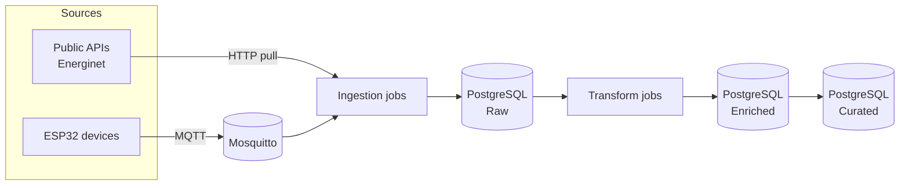
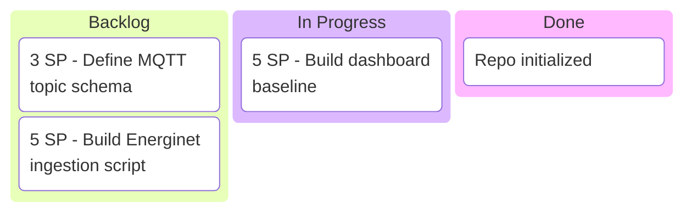
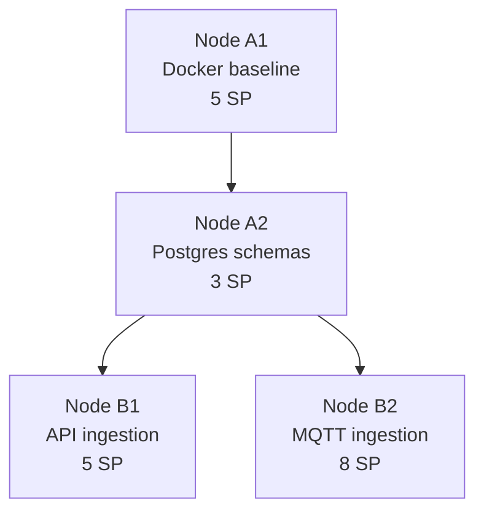

# Mermaid Guidelines (Robust Cross-Renderer)

## Goal
Keep diagrams readable and stable across:
- VS Code markdown preview
- Mermaid extension preview
- GitHub README rendering

## Repository convention
- README is the canonical display surface for project diagrams.
- `.mmd` files are optional editing helpers and must stay aligned with README blocks.

## Core rules
- Prefer simple, conservative Mermaid syntax.
- Use `flowchart` and `kanban` as default diagram types for this repo.
- Use ` ` for line breaks inside nodes.
- Avoid `\\n` in labels, because some renderers display it as plain text.
- Keep node labels short and explicit.
- Avoid special characters in labels when possible.
- Use consistent left-to-right (`LR`) or top-down (`TD`) direction.

## Flowchart conventions
- IDs: short and stable (`A1`, `B2`, `ETL`, `DB`).
- Labels: human readable and action focused.
- Edges: add edge text only when it improves clarity.
- Grouping: use subgraph for source/system boundaries.

### Recommended pattern

## Kanban conventions
- Use plain section names and card labels.
- Keep one card per line and add a blank line between cards.
- Keep story points as prefix text: `3 SP - ...`
- Avoid parentheses-heavy card labels if renderer behaves oddly.

### Recommended pattern

## Tech-tree conventions
- Use flowchart `TD` and explicit node IDs.
- Keep each node to three lines max:
  - Node ID/title
  - capability
  - story points

### Recommended pattern

## Validation workflow
1. Edit diagram in markdown.
2. Validate Mermaid syntax before commit.
3. Check both VS Code preview and GitHub rendering.
4. If rendering differs, simplify syntax and remove advanced features first.

## Troubleshooting quick checks
- If you see literal `\\n`: replace with ` `.
- If kanban cards disappear: simplify labels and spacing.
- If parser errors point at card lines: test with minimal kanban first, then add cards back incrementally.
- If preview seems stale: reload VS Code window.
