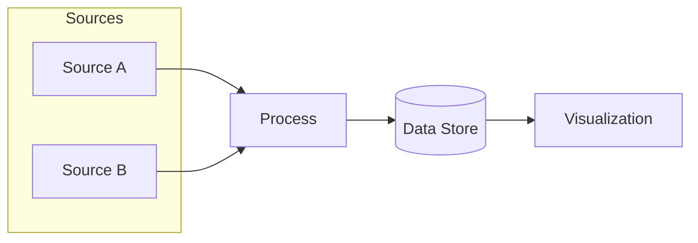
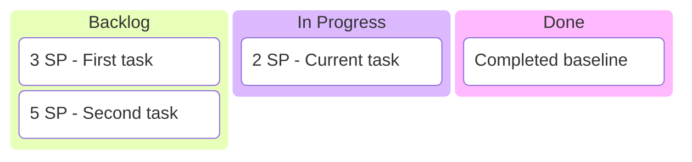
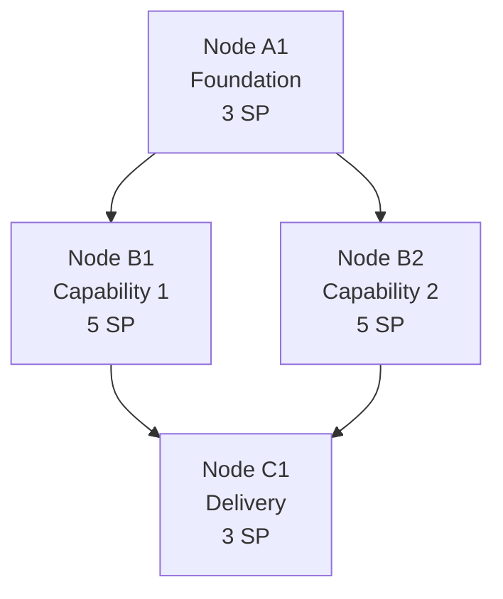

# Mermaid Templates

Use these templates when adding new diagrams.

## 1) Architecture flowchart

## 2) Project kanban

## 3) Dependency tech-tree

## Naming and readability checklist
- Stable node IDs
- Short labels
- ` ` for line breaks
- Story points as plain text
- No renderer-specific tricks unless necessary
